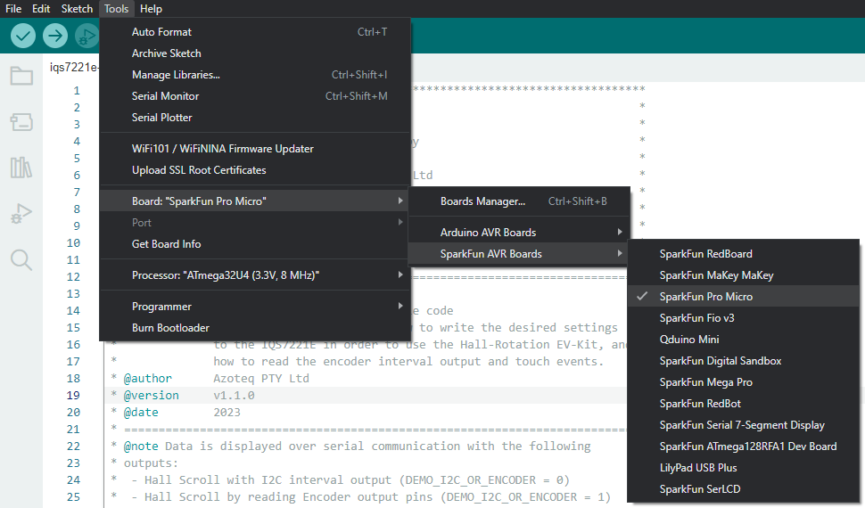

# IQS9320 Arduino Example Code

## Introduction

This Arduino example code demonstrates how to set up and use the IQS9320 Integrated Circuit (IC). The IQS9320 is a 20-channel inductive sensing device. This class provides an easy means of initializing and interacting with the IQS9320 device from an Arduino-based device.

This example code is specifically aimed at the IQS9320 Evaluation Kit (PCB number _AZP1342B1_).

This example code is intended for an Arduino Compatible board that uses 3.3 V logic, such as [Sparkfun's Pro Micro (3.3V, 8 MHz)](https://learn.sparkfun.com/tutorials/pro-micro--fio-v3-hookup-guide/hardware-overview-pro-micro). If a 5V logic Arduino board is used, a logic-level translator will be required between the Arduino-based board and the IQS9320.

## Arduino Code Configuration

The behaviour and pin assignments of the Arduino code can be configured with the `#define` settings at the start of `iqs9320-example-code.ino`.

Change the following pin assignments and parameters to suit your hardware:

```c
/*** Defines ***/
#define DEMO_IQS9320_ADDR                      0x30
#define DEMO_IQS9320_POWER_PIN                 0
#define DEMO_IQS9320_MCLR_PIN                  2
#define DEMO_IQS9320_NR_CHANNELS               20
#define DEMO_IQS9320_SAMPLE_TIME               10
```

* `DEMO_IQS9320_ADDR` is the IQS9320 I2C Slave address. For more information, refer to the datasheet and application notes found on the [IQS9320 Product Page](https://www.azoteq.com/product/iqs9320/).

* `DEMO_IQS9320_POWER_PIN` can be used to power the IQS9320 directly from an Arduino GPIO. This parameter sets which pin to use. This is an optional setting and can be removed if the IQS9320 is powered from the VCC pin or an external power supply.

* `DEMO_IQS9320_MCLR_PIN` sets the pin assignment for the IQS9320 reset pin.

* `DEMO_IQS9320_NR_CHANNELS` is the total number of active channels on the IQS9320.

* `DEMO_IQS9320_SAMPLE_TIME` is the interval at which the IQS9320 is sampled.

> :memo: **Note:** Please note that powering an IQS device directly from a GPIO is _generally_ not recommended. However, the `DEMO_IQS323_POWER_PIN` in this example could be used as an enable input to a voltage regulator.

## Example Code Flow Diagram

<p align="center">
  
</p>

## SparkFun Board Library Installation

To use the SparkFun Pro Micro, the SparkFun Board Library must be installed
in the Arduino IDE.

Add the SparkFun Board Library by opening Preferences (*File* > *Preferences*),
and paste the following URL into the "Additional Board Manager URLs" text box.

```
https://raw.githubusercontent.com/sparkfun/Arduino_Boards/master/IDE_Board_Manager/package_sparkfun_index.json
```


Click "OK".
Then open the Board Manager under **Tools** > **Board** > **Boards Manager...**.


Search for "SparkFun", and install "SparkFun AVR Boards by SparkFun".


You can now select the "SparkFun Pro Micro" in the Board selection menu.



Also be sure to select the "3.3 V, 8 MHz" version under *Tools* > *Processor*.


Source: [Pro Micro Hookup Guide](https://learn.sparkfun.com/tutorials/pro-micro--fio-v3-hookup-guide)

## Serial Communication and Interface
The example code provides verbose serial feedback to aid users in the demonstration of start-up and operational functions. A successful initialization process will show the following over serial:

